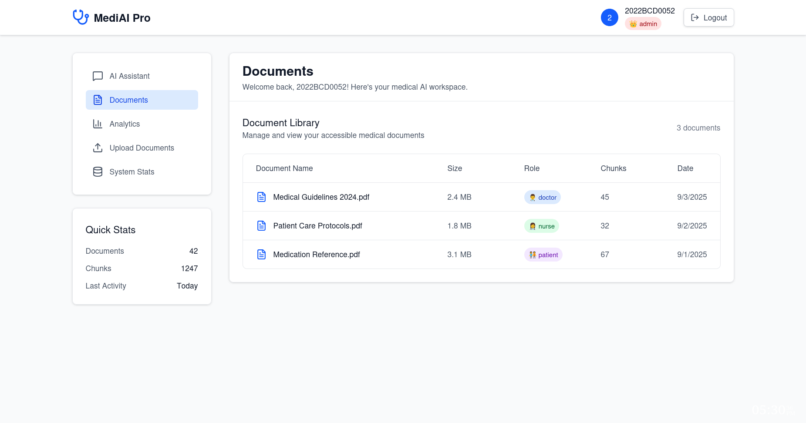
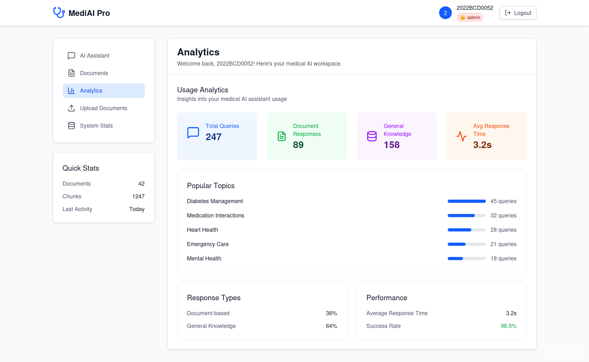
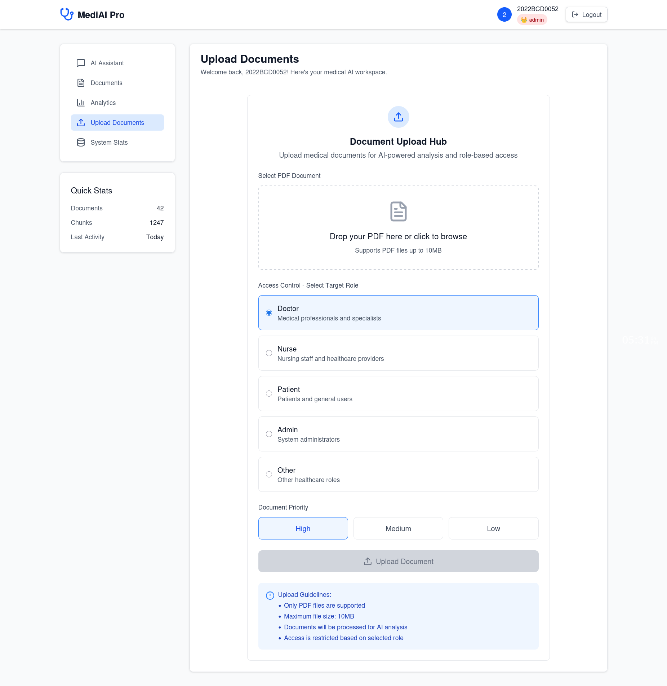
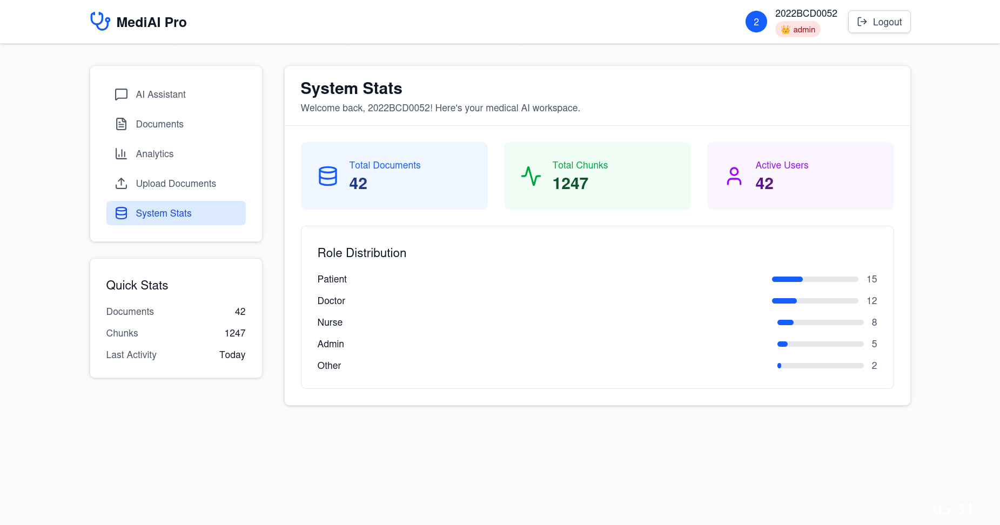

# MediAI Pro - Version 1.0 Screenshots 📸

> **Initial Release** - Core Medical AI Assistant Features

This directory contains screenshots showcasing the initial version of MediAI Pro, featuring the fundamental AI-powered medical consultation system.

---

## 📸 Screenshot Gallery

### Core Features

#### 1. Landing Page

*Clean, professional landing page introducing MediAI Pro*

#### 2. User Authentication

*Secure authentication system with role selection*

#### 3. Main Dashboard

*User dashboard with quick access to key features*

#### 4. AI Chat Interface

*Interactive AI-powered medical consultation interface*

#### 5. Document Upload

*Upload and process medical documents for AI analysis*

#### 6. Chat History

*View and manage previous conversations*

#### 7. User Profile

*Manage user profile and settings*

#### 8. System Features

*Additional system capabilities and tools*

---

## ✨ Version 1.0 Features

### Core Functionality

- 🤖 **AI Medical Assistant** - Intelligent Q&A system
- 📄 **Document Processing** - PDF upload and analysis
- 🔐 **User Authentication** - Secure login with role-based access
- 💬 **Chat Interface** - Real-time AI conversations
- 📊 **Document Management** - Organize medical documents
- 👤 **User Profiles** - Personal information management
- 📝 **Chat History** - Access previous conversations
- 🎯 **Role-Based Access** - Patient, Doctor, Nurse, Admin roles

### Technology Stack

- **Frontend:** Next.js 15, TypeScript, Tailwind CSS
- **Backend:** FastAPI, Python
- **AI/ML:** LangChain, Groq LLaMA3, Google Embeddings
- **Database:** MongoDB, Pinecone Vector Store
- **Authentication:** HTTP Basic Auth with bcrypt

---

## 🔗 Navigation

- [Main Project README](../../README.md) - Complete documentation
- [Version 2.0 Screenshots](../version2/) - Latest version with enhanced features
- [Demo Overview](../readme.md) - All versions overview

---

## 📝 Notes

- Version 1.0 represents the initial stable release
- Focus on core AI chat and document processing features
- Foundation for advanced features in Version 2.0

---

**Version:** 1.0  
**Status:** ✅ Stable  
**Release Date:** November 2025
